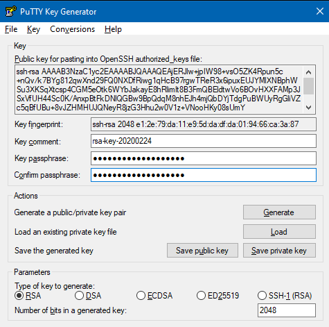

#########
SSH keys
#########

You must use an SSH key to access PEARL.

An SSH key consists of two parts; a private key and a public key. Once you have generated your key pair the private key should be loaded into your SSH agent. Your public key should be sent to us using the `application form <https://www.turing.ac.uk/research/asg/pearl#application-form>`_.

.. warning::
   **It is very important that you keep your private key safe and do not share it with anyone. We will never ask you for your private key.**

How you generate a key and add it to your agent will differ depending on the operating system that you are using.

Generating an SSH key
=====================

.. note::

   For compatibility reasons, we recommend generating a key using the *RSA* algorithm and with a key size of at least 2048 bits.

On Linux and macOS
------------------

Most Linux and macOS versions will have an SSH client and key generation utility already installed.

To generate a key pair, run the following command:

.. code-block:: console

   $ ssh-keygen -t rsa -b 4096

When you are asked where you want to save the key, accept the default location. Please also ensure that you choose a strong passphrase to protect you private key. Make a note of this as you will need it when you load your key into the agent. 

On Microsoft Windows
--------------------

We recommend that you generate an SSH key on Windows using the graphical `PuTTYgen utility <https://www.chiark.greenend.org.uk/~sgtatham/putty/latest.html>`_:

1. Launch the PuTTYgen utility
2. Make sure that **Type of key to generate** is set to **RSA**
3. Set the value for **Number of bits in a generated key** to **2048** or **4069**
4. Click **Generate** and repeatedly move your mouse over the blank area until the progress bar is full
5. In the **Key passphrase** field, enter a *strong* passphrase and then retype it in the **Confirm passphrase** field
6. Click **Save private key** and choose a suitable name for the file, *noting the location where it is saved*.
7. Right-click the **Public key for pasting into OpenSSH authorized_keys file** field and click **Select all**
8. Right-click the highlighted text and select **Copy**. This is the text that needs to be included in your application form
9. Make a note of the **Key fingerprint** string so that you can verify this key at a later time

Adding your key to the SSH Agent
================================

On Linux and macOS
------------------

1. If it is not already running, start the ``ssh-agent`` program in the background:

   .. code-block:: console

      $ eval `ssh-agent`
      Agent pid 90125

2. Load your SSH key into ``ssh-agent`` and type in the passphrase when asked to do so. If you saved your private key somewhere other than the default location then you will need to specify the path to it:

   .. code-block:: console

      $ ssh-add ~/.ssh/id_rsa

3. Additionally, if you are using macOS, you can store your passphrase in the macOS keychain so that you don't have to enter it every time:

   .. code-block:: console

      $ ssh-add -K ~/.ssh/id_rsa

On Microsoft Windows
--------------------

We recommend the `Pageant PuTTY authentication agent <https://www.chiark.greenend.org.uk/~sgtatham/putty/latest.html>`_. When the program is running, it will show as an icon in the System Tray on the taskbar.

To add a key:

1. Right-click the Pageant System Tray icon
2. Select **Add Key**
3. Navigate to the directory where you saved your private key file, select it and click **Open**
4. In the **Enter Passphrase** dialog, enter the key's passphrase and click **OK**
5. Check that the key has been loaded by right-clicking the Pageant icon again and select **View Keys**
6. In the **Pageant Keys List** dialog, check that the key's fingerprint matches the one that you noted when you created the key

